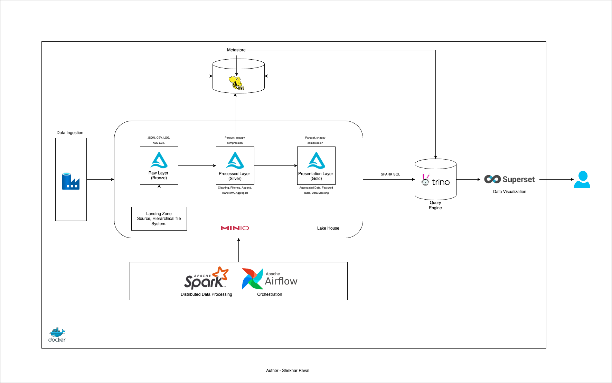

# Lake House Architecture - SPARK + MINIO + HIVE + DELATA LAKE + TRINO + SUPERSET

### In This Project we have implmented incremental data load with delta lake following medallion architecture. The project is about analysis of formula1 racing

## Architecture Diagram



## Prerequisite
- Install Docker [Docker](https://docs.docker.com/engine/install/)

## Getting Started
* Clone Repository
```
git clone https://github.com/hrimsys-tech/spark-lake-house.git lake-house
```
```commandline
cd lake-house
```
* Change Directory to docker
``` cd docker ```
### Run Following command to spinup required service follow order as mentioned
1. First run minio object storage service 
   * ```docker-compose -f docker-compose-minio.yaml up -d --build```
2. Run Hive Metastore
    * ```docker-compose -f docker-compose-hive.yaml up -d --build```
3. Run spark Master + Server
    * ```docker-compose -f docker-compose-spark.yaml up -d --build```
4. Run Trino Query Engine
    * ```docker-compose -f docker-compose-trino.yaml up -d --build```
5. Run Visulization Tool - Superset
    * * ```docker-compose -f docker-compose-superset.yaml up -d --build```

### We need to inclued aws-hadoop and aws-java-sdk bundle in jars folder under hive, it provide minio access to hive. Download both jars using following links
```commandline
https://repo1.maven.org/maven2/org/apache/hadoop/hadoop-aws/3.3.6/hadoop-aws-3.3.6.jar
```
```commandline
https://repo1.maven.org/maven2/com/amazonaws/aws-java-sdk-bundle/1.12.367/aws-java-sdk-bundle-1.12.367.jar 
```
### No we need to create bucket in Minio and Copy our dataset to that bucket
1. Visit following url ```http://localhost:9001/``` in your browser it will ask you credentials use ```root``` as username and ```password``` as password
2. Create Bucket with name ```formula1```
3. Copy all the folders under dataset to ```formula1``` bucket

### Now we are ready to process our data
1. To process data using Pyspark we need to submit our spark job to running spark cluster
```commandline
docker exec spark-master spark-submit --master spark://spark-master:7077 --packages=org.apache.hadoop:hadoop-aws:3.3.6,io.delta:delta-spark_2.12:3.2.0 app/main.py 2021-03-21
```
```commandline
docker exec spark-master spark-submit --master spark://spark-master:7077 --packages=org.apache.hadoop:hadoop-aws:3.3.6,io.delta:delta-spark_2.12:3.2.0 app/main.py 2021-03-28
```
Here Last argument in command is name of the folder we want to process

### Time to see our data anc create visualization out of it
1. Visit following url ```http://localhost:8088/``` in your browser it will ask you credentials use ```admin``` as username and ```admin``` as password
2. Connect to trino query engine, click on add database under database tab
3. Select Trino as query engine
4. Enter following trino url to connect superset with our processed data
```
trino://root@trino:8080/delta
```